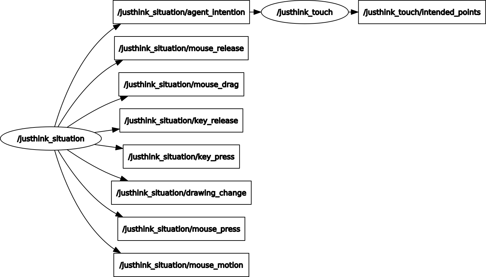

# ROS Wrappers for JUSThink Human-Robot Pedagogical Scenario

[](https://opensource.org/licenses/MIT)

## Overview

This repository contains the [ROS] packages to govern a complete human-robot interaction scenario for school children, named [JUSThink](https://www.epfl.ch/labs/chili/index-html/research/animatas/justhink/). The scenario aims to improve their computational thinking skills by applying abstract and algorithmic reasoning to solve an unfamiliar problem on networks: it consists of individual (e.g. as in a test for assessment) and collaborative (with an artificial agent e.g. a robot) activities. This code has been to govern the interaction in [[1]](#references).

The ROS packages that are included in this repository are:

* [justhink_scenario](justhink_scenario) package: creates  an application through which a human learner participates in the pedagogical scenario
* [justhink_agent](justhink_agent) package: generates the robot behavior (in a robot-generic manner)
* [justhink_robot](justhink_robot) package: manifests the robot behavior so that it is enacted by a particular robot (e.g. a [QTrobot] in our implementation, to enact the speech, gestures, etc.)
* [justhink_msgs](justhink_msgs) package: defines the custom ROS messages and services, via which these ROS nodes communicate

The pedagogical scenario consists of a sequence of activities: cover, introduction, tutorial, five individual activities (pretest), two collaborative activities, five individual activities (posttest), and a goodbye: see [[1]](#references) for details.

* In an individual activity, a human learner is given a network of rare metal mines with possible positions for railway tracks, where each track if it is built connects one mine to another. The cost of each track is visible. The goal is to collect the rare metal by connecting the rare metal mines to each other, while spending as little as possible to build the tracks.
* In a collaborative activity, the human and the robot as (same-status) peers collaboratively construct a solution to this problem by deciding together which tracks to build, and submit it as their solution to the system. They take turns in suggesting to select a specific connection, where the other either agrees or disagrees with this suggestion. A track will be built only if it is suggested by one and accepted by the other.

Here is a screenshot from the collaborative activity:


**Keywords:** artificial intelligence, human-robot interaction, mutual understanding, collaborative learning, computational thinking

### License

The whole package is under MIT License, see [LICENSE](LICENSE).

This README is based on the project [ros_best_practices](https://github.com/leggedrobotics/ros_best_practices), Copyright 2015-2017, Péter Fankhauser. It is licensed under the BSD 3-Clause Clear License. See [doc/LICENSE](doc/LICENSE) for additional details.

**Author: Utku Norman<br />
Affiliation: [CHILI Lab, EPFL](https://www.epfl.ch/labs/chili/)<br />
Maintainer: Utku Norman, utku.norman@epfl.ch**

The packages in [justhink-ros] have been tested under [ROS] Noetic Ninjemys on Ubuntu 20.04.
This is research code, expect that it changes often and any fitness for a particular purpose is disclaimed.

### Publications

If you use this work in an academic context, please cite the following publication:

* Norman, U., Chin, A., Bruno, B., & Dillenbourg, P. (2022). **Efficacy of a ‘Misconceiving’ Robot to Improve Computational Thinking in a Collaborative Problem Solving Activity: A Pilot Study.** 2022 31st IEEE International Conference on Robot & Human Interactive Communication (RO-MAN). ([PDF](https://infoscience.epfl.ch/record/294825))

        @inproceedings{norman_efficacy_2022,
            title       = {Efficacy of a 'Misconceiving' Robot to Improve Computational Thinking in a Collaborative Problem Solving Activity: A Pilot Study},
            booktitle   = {2022 31st {IEEE} International Conference on Robot \& Human Interactive Communication ({RO}-{MAN})},
            author      = {Norman, Utku and Chin, Alexandra and Bruno, Barbara and Dillenbourg, Pierre},
            month       = aug,
            year        = {2022},
            url         = {https://infoscience.epfl.ch/record/294825},
            urldate     = {2022-07-01},
        }


## Installation

### Building from Source

#### Dependencies

* [Robot Operating System (ROS)](https://docs.ros.org) (middleware for robotics)
* [justhink_world](https://github.com/utku-norman/justhink_world) to represent the activities as worlds/problems with a state (that depends on [pomdp_py](https://h2r.github.io/pomdp-py/html/), [networkx](https://networkx.org/), [pyglet](https://pyglet.readthedocs.io/en/latest/), [importlib_resources](https://importlib-resources.readthedocs.io/en/latest/), and [pqdict](https://pypi.org/project/pqdict/))
* [QTrobot ROS API headers](https://github.com/luxai-qtrobot/software/tree/master/headers) by LuxAI S.A. if you would like to use the the [justhink_robot](justhink_robot) package / QTrobot

#### Building

1) [Install ROS Noetic](http://wiki.ros.org/Installation/) if not already installed.

2) [Create or reuse a ROS workspace for catkin](http://wiki.ros.org/catkin/Tutorials/create_a_workspace) (e.g. `~/catkin_ws`):
```
# Load the default workspace.
source /opt/ros/noetic/setup.bash

# Create and overlay your catkin workspace.
mkdir -p ~/catkin_ws/src
cd ~/catkin_ws/
source devel/setup.bash
```

3) Clone these ROS packages folder ([justhink-ros]) inside the 'src' folder of your workspace:
```
cd ~/catkin_ws/src

git clone https://github.com/utku-norman/justhink-ros.git
```

4) For the dependencies, create a new Python [virtual environment](https://docs.python.org/3/tutorial/venv.html) and activate it; do so in the same folder. Note that the folder name `.venv` is [git-ignored](https://git-scm.com/docs/gitignore)):
```
cd ~/catkin_ws/src/justhink-ros

python3 -m venv .venv --prompt JUSThink-ROS-env

source .venv/bin/activate
```

If you do not have `venv`, first install it by: `sudo apt install python3-venv`

5) Install the dependency [justhink_world] Python package inside this virtual environment:
```
# Get the source code.
git clone https://github.com/utku-norman/justhink_world.git .venv/justhink_world

# Activate the virtual environment.
source .venv/bin/activate

# Install the package.
pip install -e .venv/justhink_world
```

For issues, details on installation and usage, refer to the [README](https://github.com/utku-norman/justhink_world/#readme) of [justhink_world].

6) Install Python dependencies for running ROS in the virtual environment.
```
pip install pyyaml rospkg empy
```

7) (needed for use with QTrobot only) Build the QTrobot ROS API headers (following [here](https://github.com/luxai-qtrobot/software/tree/master/headers)) to run with the robot:
```
cd ~/catkin_ws/src/justhink_robot
mkdir -p temp; cd temp

# Clone and copy the headers.
git clone https://github.com/luxai-qtrobot/software.git
cp -r software/headers/* ~/catkin_ws/src/

# Cleanup.
cd ..; rm -rf temp

# Build the packages with ROS
cd ~/catkin_ws
catkin build qt_robot_interface qt_motors_controller qt_gesture_controller
```


8) Install the ROS packages (while the virtual environment is activated): 
```
cd ~/catkin_ws

catkin build justhink_msgs

catkin build justhink_scenario

catkin build justhink_agent

# For use with the QTrobot.
catkin build justhink_robot

source devel/setup.bash
```

If you encounter an error `catkin: not found`, make sure you have sourced the ROS environment (i.e. `source ~/catkin_ws/devel/setup.bash` and `source /opt/ros/noetic/setup.bash`), and you have installed the catkin tools by `sudo apt-get install python-catkin-tools`.


9) Check the installation of e.g. `justhink_msgs` by trying to import the messages and services in a Python interpreter (after sourcing the installation, i.e.: `source ~/catkin_ws/devel/setup.bash`):
```
import justhink_msgs.msg
import justhink_msgs.srv
```

Check the installation for `justhink_scenario` (in a Python interpreter):
```
from justhink_scenario import show_scenario
```

Check for `justhink_agent`:
```
from justhink_agent.agent import RoboticAgent
```

Check for `justhink_robot`:
```
from justhink_robot.robot import PhysicalRobot
```


## Usage

### Use/Test the Application Only

1) In a terminal, start the 'roscore':
```
source /opt/ros/noetic/setup.bash
source ~/catkin_ws/devel/setup.bash

roscore
```

2) In another terminal, run the main node with:
```
source /opt/ros/noetic/setup.bash
source ~/catkin_ws/devel/setup.bash
source ~/catkin_ws/src/justhink-ros/.venv/bin/activate

# Set the namespace for the node.
export ROS_NAMESPACE=env

# Launch the app.
rosrun justhink_scenario run_scenario.py
```

* Use `CTRL+LEFT` and `CTRL+RIGHT` keys to navigate to the previous or the next activity, respectively.
* Press `A` while navigating to skip/suppress activity change animation.
* Press `SHIFT` while navigating to skip/suppress publishing activity change (for the robot not to know about it and to navigate quickly to an activity).
* Press `CTRL+SHIFT+P` to publish the current activity for the robot to be aware about it.
* Press `CTRL+P` to toggle pause, and `CTRL+TAB` to toggle the role between the human and the robot.
* Press `CTRL+ESCAPE` to quit.

Note that the collaborative part need at least the agent node running.


### Running the JUSThink Human-Agent Scenario (without a physical robot)

1) In a terminal, start the 'roscore':
```
source /opt/ros/noetic/setup.bash
source ~/catkin_ws/devel/setup.bash

roscore
```

2) (optional) In another terminal, start logging:
```
source /opt/ros/noetic/setup.bash
source ~/catkin_ws/devel/setup.bash

NO=1 # Student No
rosrun justhink_agent run_recorder.sh $NO
```

3) In another terminal, start the human application node (`situation`).
```
source /opt/ros/noetic/setup.bash
source ~/catkin_ws/devel/setup.bash
source ~/catkin_ws/src/justhink-ros/.venv/bin/activate


export ROS_LOG_DIR=$(rospack find justhink_scenario)/data/log
rm $ROS_LOG_DIR/env_situation.log

export ROS_NAMESPACE=env
rosrun justhink_scenario run_scenario.py _robot_text:=True

# You can adjust the logger level with:
# rosservice call /env/cognition/set_logger_level "{logger: 'rosout', level: 'debug'}"
```

4) In another terminal, start this robot behavior node (`cognition`):
```
source /opt/ros/noetic/setup.bash
source ~/catkin_ws/devel/setup.bash
source ~/catkin_ws/src/justhink-ros/.venv/bin/activate

export ROS_LOG_DIR=$(rospack find justhink_agent)/data/log
rm $ROS_LOG_DIR/agent_cognition.log

export ROS_NAMESPACE=agent

rosrun justhink_agent run_agent.py _mode:=greedy _with_robot:=False
```


### Complete Scenario with a QTrobot

1) For convenience, add the following aliases and environment variables to `.bash_aliases`:
```
alias sshqtrp="ssh developer@192.168.4.1"
alias sshqtpc="ssh qtrobot@192.168.100.2"

alias sourceros="source /opt/ros/noetic/setup.bash; source ~/catkin_ws/devel/setup.bash"

alias sourcejusthink="sourceros; source ~/catkin_ws/src/justhink-ros/.venv/bin/activate"

# Update ROS_IP with yours.
alias sourceqtrobot="sourceros; export ROS_IP=192.168.4.114; export ROS_MASTER_URI=http://192.168.4.1:11311"
```

2) (optional) Set the volume level of the robot (robot specific commands for testing, experimentation).
```
rosservice call /qt_robot/setting/setVolume 52    # for development
rosservice call /qt_robot/setting/setVolume 80    # for experiment

# Test robot speech, gesture and facial expression topics.
rostopic pub -1 /qt_robot/speech/say std_msgs/String "data: 'Hi'"
rostopic pub -1 /qt_robot/emotion/show std_msgs/String "data: 'QT/happy'"
rostopic pub -1 /qt_robot/emotion/show std_msgs/String "data: 'QT/kiss'"
rostopic pub -1 /qt_robot/gesture/play std_msgs/String "data: 'QT/happy'"
```

3) Start the ROS logger in a terminal:
```
sourcejusthink
sourceqtrobot

NO=1 # Sample/participant no, as a prefix for the recorded audio file (see run_justhink_recorder.sh)
rosrun justhink_robot run_justhink_recorder.sh $NO
```

4) (optional) start screen recording in another terminal:
```
sourcejusthink

NO=1 # Sample/participant no
rosrun justhink_scenario run_screen_recorder.sh $NO
```

5) Start the robot node in another terminal:
```
sourcejusthink
sourceqtrobot

export ROS_LOG_DIR=$(rospack find justhink_robot)/data/log
# rm $ROS_LOG_DIR/agent_embodiment.log

export ROS_NAMESPACE=agent

rosrun justhink_robot run_robot.py

# Test (robot generic)
rostopic pub -1 /agent/embodiment/say std_msgs/String "data: 'Hi'"
# Test (robot specific; for QTrobot)
rosservice call /qt_robot/motors/home "['HeadPitch', 'HeadYaw', 'left_arm', 'right_arm']"  # Home all
```

6) Start the agent node in another terminal:
```
sourcejusthink
sourceqtrobot

# Set path for ROS log files for the node.
export ROS_LOG_DIR=$(rospack find justhink_agent)/data/log
# rm $ROS_LOG_DIR/agent_cognition.log

export ROS_NAMESPACE=agent

# Choose one of the following.
rosrun justhink_agent run_agent.py _mode:=optimal
# rosrun justhink_agent run_agent.py _mode:=greedy
# rosrun justhink_agent run_agent.py _mode:=aligning
```

7) Start the situation node (i.e. the learning scenario) in another terminal:
```
sourcejusthink
sourceqtrobot

# Set path for ROS log files for the node.
export ROS_LOG_DIR=$(rospack find justhink_scenario)/data/log
# rm $ROS_LOG_DIR/env_situation.log

export ROS_NAMESPACE=env

# Choose one of the following.
rosrun justhink_scenario run_scenario.py
# rosrun justhink_scenario run_scenario.py _entry:=collaboration-1
# rosrun justhink_scenario run_scenario.py _entry:=collaboration-2
# rosrun justhink_scenario run_scenario.py _robot_text:=True
```


### Useful Commands

Verbose diagnostics logging.
```
# Set to debug level for one of the nodes.
export NODE=/agent/cognition
# export NODE=/env/situation

rosservice call $NODE/set_logger_level "{logger: 'rosout', level: 'debug'}"

# Set back to default info level.
rosservice call $NODE/set_logger_level "{logger: 'rosout', level: 'info'}"
```


### Running with a touchscreen

#### Mapping the touch interface onto the touchscreen

Check the name of the touch controller, e.g. "USBest Technology SiS HID Touch Controller"
```
xinput
```

2) Check the name of the screen, e.g. "DP-3"
```
xrandr -q
```

3) Map the touch controller to the screen, e.g., if it is DP-3 from the previous step:
```
xinput map-to-output "USBest Technology SiS HID Touch Controller" DP-3
```

#### Hiding the cursor on touch events

Install the fork of unclutter that hides the cursor for touch only (The default `unclutter` from apt does not have the option "-touch" to specifically hide a touchscreens' input device.)
```
sudo apt install asciidoc libev-dev libxslt1-dev docbook-xsl xsltproc libxml2-utils    # Prerequisites
git clone https://github.com/nowrep/unclutter-xfixes.git
cd unclutter-xfixes
make
sudo make install
```

5) Run unclutter on a separate terminal. Touch on the screen will not show cursor.
```
unclutter -touch
```

#### Rotating the screen by 180 degrees
To prevent the power button being pressed accidentally (normally bottom right corner, if rotated top left corner)

1) In Display setting of Ubuntu, change Rotation to 180 degrees.

2) Remap the touch upside-down.
```
xinput set-prop "USBest Technology SiS HID Touch Controller" --type=float "Coordinate Transformation Matrix" 0 -1 1 1 0 0 0 0 1
```


## Nodes


The ROS computation graph for the three nodes (`situation`, `cognition` and `embodiment`: see below) as visualized by [rqt_graph](http://wiki.ros.org/rqt_graph) is as follows:





### situation 

Launches the JUSThink application for the human to interact with the pedagogical scenario.

This node has with global name set to `/env/situation`, and it is implemented in the [justhink_scenario](justhink_scenario) package.


#### Subscribed Topics

* **`/env/situation/act`** ([justhink_msgs/Action](justhink_msgs/msg/Action.msg))

    Executes an action in the activity for the robot to take actions like suggesting a connection etc. For example, you can execute an action from the terminal with:

        rostopic pub -1 /env/situation/act justhink_msgs/Action Robot 0 "{u: 1, v: 4}"


    You can check the action types with:

        rosmsg info justhink_msgs/Action


#### Published Topics

* **`/env/situation/event`** ([justhink_msgs/StateTransition](justhink_msgs/msg/StateTransition.msg))

    State transitions as 3-tuples < state, action, next state >, with a header for a timestamp and an activity name, for the robot to know what is the state of the world being displayed on the application.

* **`/env/situation/onset`** ([justhink_msgs/ActivityTransition](justhink_msgs/msg/ActivityTransition.msg))

    Activity changes as 2-tuples < current activity name, next activity name >, with a header that contains a timestamp and an activity name, for the robot to know that the activity being displayed on the application has changed.

* **`/env/situation/button_press`** ([justhink_msgs/Button](justhink_msgs/msg/Button.msg))

    Mouse clicks on the buttons as 2-tuples < button name, button state > when its clicked (states e.g. enabled, disabled, selected), with a header that contains a timestamp and an activity name, for logging purposes.

* **`/env/situation/drawing_change`** ([justhink_msgs/Drawing](justhink_msgs/msg/Drawing.msg))

    Changes in the source or destination nodes of the temporarily drawn edges, with a header that contains a timestamp and an activity name, for logging purposes. -1 indicates no source or destination node is dragged at.

* **`/env/situation/mouse_press`** ([justhink_msgs/Mouse](justhink_msgs/msg/Mouse.msg))

    Mouse clicks that have position, position difference and mouse button information, with a header that contains a timestamp and an activity name, for logging purposes.

* **`/env/situation/mouse_drag`** ([justhink_msgs/Mouse](justhink_msgs/msg/Mouse.msg))

    Mouse drags that have position, position difference and mouse button information, with a header that contains a timestamp and an activity name, for logging purposes.

* **`/env/situation/mouse_release`** ([justhink_msgs/Mouse](justhink_msgs/msg/Mouse.msg))

    Mouse releases that have position, position difference and mouse button information, with a header that contains a timestamp and an activity name, for logging purposes.

* **`/env/situation/mouse_motion`** ([justhink_msgs/Mouse](justhink_msgs/msg/Mouse.msg))

    Mouse movements that have position, position difference and mouse button information, with a header that contains a timestamp and an activity name, for logging purposes.

* **`/env/situation/key_press`** ([justhink_msgs/Key](justhink_msgs/msg/Key.msg))

    Key presses on the keyboard that have the symbol and modifiers information, for logging purposes.

* **`/env/situation/key_release`** ([justhink_msgs/Key](justhink_msgs/msg/Key.msg))

    Key releases on the keyboard that have the symbol and modifiers information, for logging purposes.


#### Services

* **`/env/situation/act`** ([justhink_msgs/Act](justhink_msgs/srv/Act.srv))

    Executes an action in the activity for the robot to take actions like suggesting a connection etc. For example, you can execute an action from the terminal with:

        rosservice call /env/situation/act "action: {agent: Human, type: 1, edge: {u: 1, v: 4}}"

    As another example, you can reset the problem state with

        rosservice call /env/situation/act "action: {agent: Human, type: 9}"

* **`/env/situation/observe_activity`** ([justhink_msgs/ObserveActivity](justhink_msgs/srv/ObserveActivity.srv))

    Retrieves the name of the current activity being shown in the application. For example, you can retrieve this information from the terminal with:

        rosservice call /env/situation/observe_activity

* **`/env/situation/observe_state`** ([justhink_msgs/ObserveState](justhink_msgs/srv/ObserveState.srv))

    Retrieves the state of the current activity being shown in the application. For example, you can retrieve this information from the terminal with:

        rosservice call /env/situation/observe_state

* **`/env/situation/pause`** ([justhink_msgs/Pause](justhink_msgs/srv/Pause.srv))

    Sets the pause status of the application. If paused, no action can be taken by the human, e.g. while the robot is speaking. For example, you can pause the application from the terminal with:

        rosservice call /env/situation/pause True

* **`/env/situation/set_activity`** ([justhink_msgs/SetActivity](justhink_msgs/srv/SetActivity.srv))

    Sets the activity being shown in the application. For example, you can set the application to the posttest's first activity from the terminal with:

        rosservice call /env/situation/set_activity 'posttest-1'

* **`/env/situation/set_robot_text`** ([justhink_msgs/SetRobotText](justhink_msgs/srv/SetRobotText.srv))

    Sets the robot text being displayed in the application. For example, you can set this text from the terminal with:

        rosservice call /env/situation/set_robot_text 'Hello, I am a robot!'


### cognition

Launches the JUSThink agent behavior.

This node has with global name set to `/agent/cognition`, and it is implemented in the [justhink_agent](justhink_agent) package.


#### Subscribed Topics

* **`/env/situation/event`** ([justhink_msgs/StateTransition](justhink_msgs/msg/StateTransition.msg))

    State transitions as 3-tuples < state, action, next state >, with a header for a timestamp and an activity name, for the robot to know what is the state of the world being displayed on the application.

* **`/env/situation/onset`** ([justhink_msgs/ActivityTransition](justhink_msgs/msg/ActivityTransition.msg))

    Activity changes as 2-tuples < current activity name, next activity name >, with a header that contains a timestamp and an activity name, for the robot to know that the activity being displayed on the application has changed.


#### Published Topics


* **`/agent/embodiment/say`** (std_msgs/String)

    Commands sent for the robot to make an utterance.

* **`/agent/embodiment/express`** (std_msgs/String)

    Commands sent for the robot to make a gesture.

* **`/agent/embodiment/emote`** (std_msgs/String)

    Commands sent for the robot to display an (e.g. facial) emotion expression.

* **`/agent/embodiment/log_say`** (std_msgs/String)

    Calls to `/agent/embodiment/say` service, for logging purposes.
    
* **`/agent/embodiment/log_express`** (std_msgs/String)

    Calls to `/agent/embodiment/express` service, for logging purposes.

* **`/agent/embodiment/log_emote`** (std_msgs/String)

    Calls to `/agent/embodiment/emote` service, for logging purposes.

* **`/agent/embodiment/log_act`** ([justhink_msgs/Action](justhink_msgs/msg/Action.msg))

    Calls to `/justhink_scenario/act` service, for logging purposes.

* **`/agent/embodiment/log_pause`** ([std_msgs/Bool])

    Calls to `/justhink_scenario/pause` service, with the requested pause status in the call's data as the content, for logging purposes.

* **`/agent/embodiment/log_set_activity`** (std_msgs/String)

    Calls to `/justhink_scenario/set_activity` service, with the activity name in the call's data as the content, for logging purposes.

* **`/agent/embodiment/log_observe_activity`** (std_msgs/String)

    Calls to `/justhink_scenario/observe_activity` service, with the activity name in the response as the content, for logging purposes.

* **`/agent/embodiment/log_observe_state`** ([justhink_msgs/EnvState](justhink_msgs/msg/EnvState.msg))

    Calls to `/justhink_scenario/observe_state` service, with state in the response as the content, for logging purposes.

* **`/agent/embodiment/log_set_robot_text`** (std_msgs/String)

    Calls to `/justhink_scenario/set_robot_text` service, with text in the call's data as the content, for logging purposes.


#### Services

* **`repeat_speech`** ([justhink_msgs/RepeatSpeech](justhink_msgs/srv/RepeatSpeech.srv))

    Makes the robot repeat what it previously said. For example, you can trigger this from the terminal with:

        rosservice call /justhink_agent/repeat_speech

* **`request_help`** ([justhink_msgs/RequestHelp](justhink_msgs/srv/RequestHelp.srv))

    Makes the robot help the human on what to do in connection to the activity. For example, you can trigger this from the terminal with:

        rosservice call /justhink_agent/request_help


### embodiment

Launches the JUSThink robot driver.

This node has with global name set to `/agent/embodiment`, and it is implemented in the [justhink_robot](justhink_robot) package.


#### Subscribed Topics

* **`say`** (std_msgs/String)

    Commands sent for the robot to make an utterance. For example, you can trigger this from the terminal with:

        rostopic pub -1 /agent/embodiment/say std_msgs/String "data: 'Hi'"

* **`express`** (std_msgs/String)

    Commands sent for the robot to make a gesture. For example:

        rostopic pub -1 /agent/embodiment/express std_msgs/String "data: 'point_human'"


* **`emote`** (std_msgs/String)

    Commands sent for the robot to display an (e.g. facial) emotion expression. For example:

        rostopic pub -1 /agent/embodiment/emote std_msgs/String "data: 'smile'"


#### Published Topics

##### For QTrobot

* **`/qt_robot/behavior/talkText`** (std_msgs/String)

    Commands sent for the robot to make an utterance.

* **`/qt_robot/gesture/play`** (std_msgs/String)

    Commands sent for QTrobot to make a gesture.

* **`/qt_robot/emotion/show`** (std_msgs/String)

    Commands sent for QTrobot to display a facial expression.


#### Services

* **`say`** ([justhink_msgs/Say](justhink_msgs/srv/Say.srv))

    Makes the robot say an utterance. For example, you can trigger this from the terminal with:

        rosservice call /agent/embodiment/say "message: 'Hi'"

* **`express`** ([justhink_msgs/Express](justhink_msgs/srv/Express.srv))

    Makes the robot express a gesture. For example:

        rosservice call /agent/embodiment/express 'point_self' 1

* **`emote`** ([justhink_msgs/Emote](justhink_msgs/srv/Emote.srv))

    Makes the robot express an emotion. For example:

        rosservice call /agent/embodiment/emote "name: 'happy'"

* **`home`** ([justhink_msgs/Home](justhink_msgs/srv/Home.srv))

    Home parts of the robot.

        rosservice call /agent/embodiment/home ['HeadPitch']    # Home head
        rosservice call /agent/embodiment/home "['HeadPitch', 'left_arm', 'right_arm']"    # Home all

* **`configure_speech`** ([justhink_msgs/ConfigureSpeech](justhink_msgs/srv/ConfigureSpeech.srv))

    Configure robot speech: language, pitch, speed

        rosservice call /agent/embodiment/configure_speech en-US 100 80
        # rosservice call /qt_robot/speech/config en-US 100 80 ## e.g., the corresponding call
        
* **`stop_say`** ([justhink_msgs/StopSay](justhink_msgs/srv/StopSay.srv))

    Stop robot speech.

        rosservice call /agent/embodiment/stop_say

* **`stop_emote`** ([justhink_msgs/StopSay](justhink_msgs/srv/StopSay.srv))

    Stop robot express an emotion.

        rosservice call /agent/embodiment/stop_emote

* **`stop_express`** ([justhink_msgs/StopExpress](justhink_msgs/srv/StopExpress.srv))

    Stop robot express a gesture.

        rosservice call /agent/embodiment/stop_express


## Acknowledgements

This project has received funding from the European Union's Horizon 2020 research and innovation programme under grant agreement No 765955. Namely, the [ANIMATAS Project](https://www.animatas.eu/).

## Bugs & Feature Requests

Please report bugs and request features using the [Issue Tracker](https://github.com/utku-norman/justhink-ros/issues).


## References <a name="references"></a>

[1] U. Norman, A. Chin, B. Bruno, and P. Dillenbourg, “Efficacy of a ‘Misconceiving’ Robot to Improve Computational Thinking in a Collaborative Problem Solving Activity: A Pilot Study,” 2022. 31st IEEE International Conference on Robot & Human Interactive Communication (RO-MAN). Accessed: Jul. 01, 2022. [Online]. Available: https://infoscience.epfl.ch/record/294825


[ROS]: http://www.ros.org
[justhink_world]: https://github.com/utku-norman/justhink_world
[justhink-ros]: https://github.com/utku-norman/justhink-ros
[QTrobot]: https://luxai.com/
