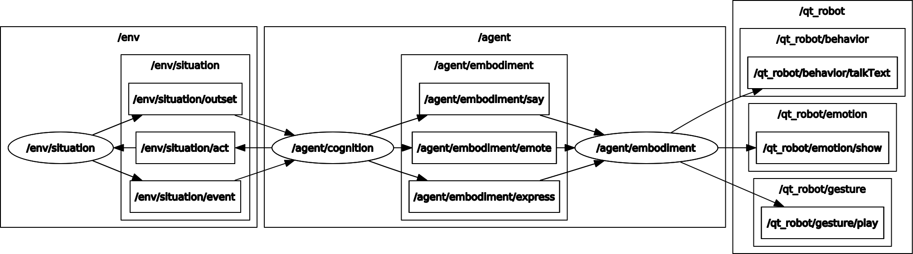

# ROS2 Wrappers for JUSThink Human-Robot Pedagogical Scenario

[](https://opensource.org/licenses/MIT)

## Overview

### License

The whole package is under MIT License, see [LICENSE](LICENSE).

This README is based on the project [ros_best_practices](https://github.com/leggedrobotics/ros_best_practices), Copyright 2015-2017, Péter Fankhauser. It is licensed under the BSD 3-Clause Clear License. See [doc/LICENSE](doc/LICENSE) for additional details.

**Author: Utku Norman<br />
Affiliation: [CHILI Lab, EPFL](https://www.epfl.ch/labs/chili/)<br />
Maintainer: Utku Norman, utku.norman@epfl.ch**

The packages in [justhink-ros] has been tested under [ROS2] Foxy on Ubuntu 20.04.
This is research code, expect that it changes often and any fitness for a particular purpose is disclaimed.


## Installation

### Building from Source

#### Dependencies

* [Robot Operating System (ROS 2)](https://docs.ros.org) (middleware for robotics)
* [justhink_world](https://github.com/utku-norman/justhink_world) to represent an activity as a world/problem with a state (that depends on [pomdp_py](https://h2r.github.io/pomdp-py/html/), [networkx](https://networkx.org/), [pyglet](https://pyglet.readthedocs.io/en/latest/), [importlib_resources](https://importlib-resources.readthedocs.io/en/latest/), and [pqdict](https://pypi.org/project/pqdict/))

#### Building

1) [Create or reuse a ROS2 workspace](https://docs.ros.org/en/foxy/Tutorials/Workspace/Creating-A-Workspace.html) (e.g. `~/ros_ws`):
```
# Load the default workspace.
source /opt/ros/foxy/setup.bash

# Create and overlay your own workspace.
mkdir -p ~/ros_ws/src

cd ~/ros_ws/
```

2) Clone this [justhink-ros] ROS2 packages folder inside the 'src' folder of your workspace and switch to the `ros2` branch:
```
cd ~/ros_ws/src

git clone https://github.com/utku-norman/justhink-ros.git

cd justhink-ros
git checkout ros2
```

3) For the dependencies, create a new Python [virtual environment](https://docs.python.org/3/tutorial/venv.html) and activate it. 
Do so in the same folder. 
Note that the folder name `venv` is [git-ignored](https://git-scm.com/docs/gitignore)):
```
cd ~/ros_ws/src/justhink-ros

python3 -m venv venv
touch venv/COLCON_IGNORE

source venv/bin/activate
```

If you do not have `venv`, first install it by: `sudo apt install python3-venv`

4) Install the dependency [justhink_world] Python package inside this virtual environment:
```
cd ~/ros_ws/src/justhink-ros/venv

# Get the source code.
git clone https://github.com/utku-norman/justhink_world.git

# Activate the virtual environment.
source bin/activate

# Go into the source code and install it.
cd justhink_world
pip install -e .

# Install Python dependencies for running ROS in the virtual environment.
# pip install empy catkin_pkg lark

# No longer use the virtual environment; we simply refer to it for the installation of justhink_world to keep it encapsulated and independent.
# deactivate
```

For issues, details on installation and usage, refer to the [README](https://github.com/utku-norman/justhink_world/#readme) of [justhink_world].

5) Install these packages:
```
cd ~/ros_ws

source /opt/ros/foxy/setup.bash

colcon build --packages-up-to justhink_touch

. install/local_setup.bash
```


## Usage


In a terminal, run the justhink_situation node with:
```
cd ~/ros_ws

source /opt/ros/foxy/setup.bash
source install/local_setup.bash

# Do this once per terminal not to extend PYTHONPATH with the same entry.
export PYTHONPATH=$PYTHONPATH:/home/utku/ros_ws/src/justhink-ros/venv/lib/python3.8/site-packages/

ros2 run justhink_situation show_situation
```


In another terminal, run the justhink_touch node with:
```
cd ~/ros_ws

source /opt/ros/foxy/setup.bash
source install/local_setup.bash

export PYTHONPATH=$PYTHONPATH:/home/utku/ros2_foxy/src/justhink-ros/venv/lib/python3.8/site-packages/

ros2 run justhink_touch convert_touch
```


### Running with a touch screen

#### Mapping the touch interface onto the touch screen

Check the name of the touch controller, e.g. "USBest Technology SiS HID Touch Controller"
```
xinput
```

2) Check the name of the screen, e.g. "DP-3"
```
xrandr -q
```

3) Map the touch controller to the screen, e.g., if it is DP-3 from the previous step:
```
xinput map-to-output "USBest Technology SiS HID Touch Controller" DP-3
```

#### Hiding the cursor on touch events

Install the fork of unclutter that hides the cursor for touch only (The default unclutter from apt does not have "-touch".)
```
sudo apt install asciidoc libev-dev libxslt1-dev docbook-xsl xsltproc libxml2-utils    # Prerequisites
git clone https://github.com/nowrep/unclutter-xfixes.git
cd unclutter-xfixes
make
sudo make install
```

5) Run unclutter on a separate terminal. Touch on the screen will not show cursor.
```
unclutter -touch
```

#### Rotating the screen by 180 degrees
To prevent the power button being pressed accidentally (normally bottom right corner, if rotated top left corner)

1) In Display setting of Ubuntu, change Rotation to 180 degrees.

2) Remap the touch upside-down.
```
xinput set-prop "USBest Technology SiS HID Touch Controller" --type=float "Coordinate Transformation Matrix" 0 -1 1 1 0 0 0 0 1
```


## Nodes

### justhink_situation

Launches a simple application to monitor mouse and key events in ROS2.
Default size is 1920x1080, and the window is by default moved to the external screen.

A screenshot from the window:


The ROS computation graph (as visualised by [rqt_graph](http://wiki.ros.org/rqt_graph)) is as follows:





#### Subscribed Topics

None.


#### Published Topics


* **`agent_intention`** ([[justhink_interfaces/Action]](https://github.com/utku-norman/justhink-ros/justhink_interfaces/blob/main/msg/Mouse.msg))

	Intended action of the agent/robot.
	Use `A` key on the activity to publish on this topic.
	Note that if you use `CTRL+A`, the action will also be executed directly.

	For example, one can monitor the action with

			ros2 topic echo /justhink_situation/agent_intention


	If you encounter the error: `ModuleNotFoundError: No module named 'justhink_interfaces'`, make sure you source the workspace by:

			cd ~/ros_ws
			source install/local_setup.bash


* **`/justhink_situation/drawing_change`** ([[justhink_interfaces/EdgeDrawing]](https://github.com/utku-norman/justhink-ros/justhink_interfaces/blob/main/msg/EdgeDrawing.msg))

	Changes in the source or destination nodes of the temporarily drawn edges, with a header that contains a timestamp and an activity name. -1 indicates no source or destination node is selected (for `click` mode drawing) or dragged at (for `drag` mode drawing).

	For example, one can monitor the mouse motion events with

			ros2 topic echo /justhink_situation/drawing_change


* **`mouse_motion`** ([[justhink_interfaces/Mouse]](https://github.com/utku-norman/justhink-ros/justhink_interfaces/blob/main/msg/Mouse.msg))

	Mouse movements that have position and button information, with a header that contains a timestamp and an activity name.

	For example, one can monitor the mouse motion events with

			ros2 topic echo /justhink_situation/mouse_motion


* **`mouse_press`** ([[justhink_interfaces/Mouse]](https://github.com/utku-norman/justhink-ros/justhink_interfaces/blob/main/msg/Mouse.msg))

	Mouse clicks that have position and button information, with a header that contains a timestamp and an activity name.

	For example, one can monitor the mouse press events with

			ros2 topic echo /justhink_situation/mouse_press

* **`mouse_drag`** ([[justhink_interfaces/Mouse]](https://github.com/utku-norman/justhink-ros/justhink_interfaces/blob/main/msg/Mouse.msg))

	Mouse drags that have position, position difference and mouse button information, with a header that contains a timestamp and an activity name.

	For example, one can monitor the mouse drag events with

			ros2 topic echo /justhink_situation/mouse_drag

* **`mouse_release`** ([[justhink_interfaces/Mouse]](https://github.com/utku-norman/justhink-ros/justhink_interfaces/blob/main/msg/Mouse.msg))

	Mouse releases that have position and button information, with a header that contains a timestamp and an activity name.

	For example, one can monitor the mouse release events with

			ros2 topic echo /justhink_situation/mouse_release

* **`key_press`** ([[justhink_interfaces/Key]](https://github.com/utku-norman/justhink-ros/justhink_interfaces/blob/main/msg/Key.msg))

	Key presses on the keyboard that have the symbol and modifiers information, with a header that contains a timestamp and an activity name.

	For example, one can monitor the key press events with

			ros2 topic echo /justhink_situation/key_press

* **`key_release`** ([[justhink_interfaces/Key]](https://github.com/utku-norman/justhink-ros/justhink_interfaces/blob/main/msg/Key.msg))

	Key releases on the keyboard that have the symbol and modifiers information, with a header that contains a timestamp and an activity name.

	For example, one can monitor the key release events with

			ros2 topic echo /justhink_situation/key_release


### justhink_touch


#### Subscribed Topics


* **`agent_intention`** ([[justhink_interfaces/Action]](https://github.com/utku-norman/justhink-ros/justhink_interfaces/blob/main/msg/Action.msg))

	Intended action of the agent/robot.
	Use `A` key on the activity to publish on this topic.
	Note that if you use `CTRL+A`, the action will also be executed directly.

	For example, one can monitor the action with

			ros2 topic echo /justhink_situation/agent_intention


	If you encounter the error: `ModuleNotFoundError: No module named 'justhink_interfaces'`, make sure you source the workspace by:

			cd ~/ros_ws
			source install/local_setup.bash


#### Published Topics


* **`intended_points`** ([[justhink_interfaces/PointDrawing]](https://github.com/utku-norman/justhink-ros/justhink_interfaces/blob/main/msg/PointDrawing.msg))

	Intended action from point in pixels to point in pixels of the agent/robot.
	Use `A` key on the activity window to publish on topic`/justhink_situation/agent_intention`, which is converted by justhink_touch node to a point to point drawing intention that is published on this topic.
	
	(Note that if you use `CTRL+A`, the action will also be executed directly on the window.)

	For example, one can monitor the topic with

			ros2 topic echo /justhink_touch/intended_points

	If you encounter the error: `ModuleNotFoundError: No module named 'justhink_interfaces'`, make sure you source the workspace by:

			cd ~/ros_ws
			source install/local_setup.bash

## Acknowledgements

This project has received funding from the European Union's Horizon 2020 research and innovation programme under grant agreement No 765955. Namely, the [ANIMATAS Project](https://www.animatas.eu/).

## Bugs & Feature Requests

Please report bugs and request features using the [Issue Tracker](https://github.com/utku-norman/justhink_situation/issues).


[ROS2]: http://www.ros.org
[justhink_world]: https://github.com/utku-norman/justhink_world