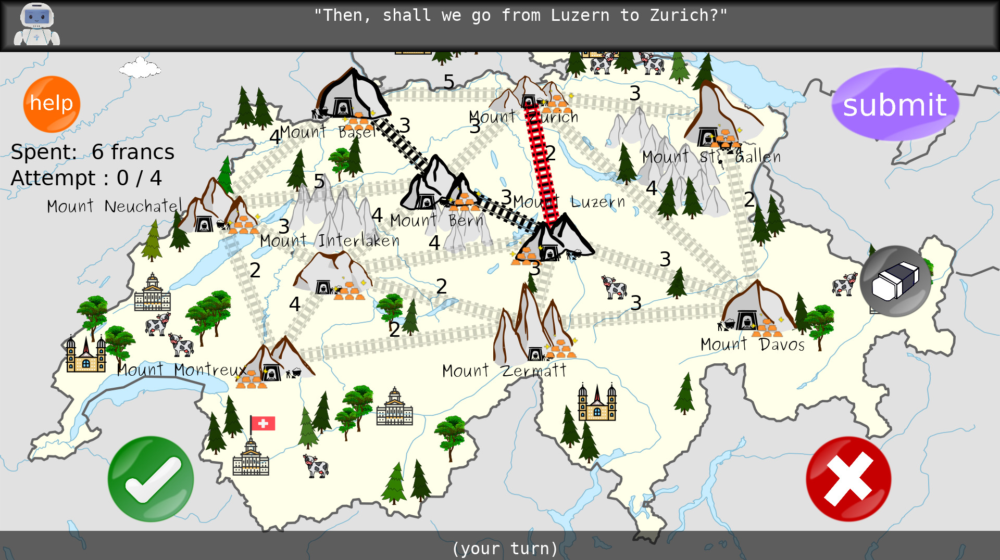

# JUSThink Agent

[](https://opensource.org/licenses/MIT)

## Overview

This repository contains the [ROS] package to generate the robot behaviour in a human-robot collaborative learning activity for school children, named [JUSThink](https://www.epfl.ch/labs/chili/index-html/research/animatas/justhink/). The scenario aims to improve their computational thinking skills by applying abstract and algorithmic reasoning to solve an unfamiliar problem on networks.

The pedagogical scenario consists of a sequence of activities: cover, introduction, tutorial, five individual activities (pretest), two collaborative activities, five individual activities (posttest), and a goodbye. In a collaborative activity, the human and the robot as (same-status) peers collaboratively construct a solution to this problem by deciding together which tracks to build, and submit it as their solution to the system. They take turns in suggesting to select a specific connection, where the other either agrees or disagrees with this suggestion. A track will be built only if it is suggested by one and accepted by the other.

A human learner participates in the pedagogical scenario through an application ([justhink_scenario]). The robot behaviour is generated by [justhink_agent] and manifested (on e.g. [QTrobot]) by [justhink_robot]. These are [ROS] nodes that communicate via the custom ROS messages and services defined in [justhink_msgs].

**Keywords:** artificial intelligence, human-robot interaction, mutual understanding, collaborative learning, computational thinking

### License

The whole package is under MIT License, see [LICENSE](LICENSE).

This README is based on the project [ros_best_practices](https://github.com/leggedrobotics/ros_best_practices), Copyright 2015-2017, Péter Fankhauser. It is licensed under the BSD 3-Clause Clear License. See [doc/LICENSE](doc/LICENSE) for additional details.

**Author: Utku Norman<br />
Affiliation: [CHILI Lab, EPFL](https://www.epfl.ch/labs/chili/)<br />
Maintainer: Utku Norman, utku.norman@epfl.ch**

The [justhink_agent] package has been tested with [ROS Noetic](http://wiki.ros.org/noetic) and Python 3.8 (in Ubuntu 20.04 LTS).
This is research code, expect that it changes often and any fitness for a particular purpose is disclaimed.





Check out the the [ROS best practices](https://github.com/leggedrobotics/ros_best_practices) that which this README is based on.

### Publications

If you use this work in an academic context, please cite the following publication(s):

* U. Norman, B. Bruno, and P. Dillenbourg, **Mutual Modelling Ability for a Humanoid Robot: How can it improve my learning as we solve a problem together?,** in Robots for Learning Workshop in 16th annual IEEE/ACM Conference on Human-Robot Interaction (HRI 2021). ([PDF](http://infoscience.epfl.ch/record/283614))

        @conference{norman_mutual_2021,
        	author = {Norman, Utku and Bruno, Barbara and Dillenbourg, Pierre},
        	booktitle = {Robots for Learning Workshop in 16th annual {IEEE}/{ACM} Conference on Human-Robot Interaction ({HRI} 2021)},
        	title = {Mutual Modelling Ability for a Humanoid Robot: How can it improve my learning as we solve a problem together?},
        	url = {http://infoscience.epfl.ch/record/283614},
        	year = {2021},
        }


## Installation

### Building from Source

#### Dependencies

* [Robot Operating System (ROS)](http://wiki.ros.org) (middleware for robotics) for the communication between the human application and the robot
* [justhink_scenario] to display the application and run the pedagogical scenario 
* [justhink_world](https://github.com/utku-norman/justhink_world) to represent an activity as a world/problem with a state (that depends on [pomdp_py](https://h2r.github.io/pomdp-py/html/), [networkx](https://networkx.org/), [pyglet](https://pyglet.readthedocs.io/en/latest/), [importlib_resources](https://importlib-resources.readthedocs.io/en/latest/), and [pqdict](https://pypi.org/project/pqdict/))
* [justhink_msgs] for the custom ROS headers between [justhink_scenario] and [justhink_agent]
* [QTrobot ROS API headers](https://github.com/luxai-qtrobot/software/tree/master/headers)

#### Building

1) Install the [justhink_scenario] ROS package by following its [README](https://github.com/utku-norman/justhink_scenario/#readme).

2) Clone this [justhink_agent] ROS package (inside the 'src' folder of the catkin workspace, e.g. `~/catkin_ws/src`)
```
cd ~/catkin_ws/src 
git clone https://github.com/utku-norman/justhink_agent.git
```

3) Build the package (that also installs the justhink_agent Python package) with ROS
```
cd ~/catkin_ws
catkin build justhink_agent
```

4) Check the installation by running the following in a Python interpreter:
```
from justhink_agent.agent import RoboticAgent
```

### Useful Commands

Verbose diagnostics logging.
```
# Set to debug level.
export NODE=/agent/cognition
export NODE=/env/situation

rosservice call $NODE/set_logger_level "{logger: 'rosout', level: 'debug'}"

# Set back to default info level.
rosservice call $NODE/set_logger_level "{logger: 'rosout', level: 'info'}"
```


## Nodes

### cognition

Launches the JUSThink agent behaviour.

The ROS computation graph (as visualised by [rqt_graph](http://wiki.ros.org/rqt_graph)) is as follows:


#### Subscribed Topics

* **`/env/situation/event`** ([[justhink_msgs/StateTransition]](https://github.com/utku-norman/justhink_msgs/blob/main/msg/StateTransition.msg))

	State transitions as 3-tuples < state, action, next state >, with a header for a timestamp and an activity name, for the robot to know what is the state of the world being displayed on the application.

* **`/env/situation/onset`** ([[justhink_msgs/ActivityTransition]](https://github.com/utku-norman/justhink_msgs/blob/main/msg/ActivityTransition.msg))

	Activity changes as 2-tuples < current activity name, next activity name >, with a header that contains a timestamp and an activity name, for the robot to know that the activity being displayed on the application has changed.


#### Published Topics


* **`/agent/embodiment/say`** ([std_msgs/String])

	Commands sent for the robot to make an utterance.

* **`/agent/embodiment/express`** ([std_msgs/String])

	Commands sent for the robot to make a gesture.

* **`/agent/embodiment/emote`** ([std_msgs/String])

	Commands sent for the robot to display an (e.g. facial) emotion expression.

* **`/agent/embodiment/log_say`** ([std_msgs/String])

	Calls to `/agent/embodiment/say` service, for logging purposes.
	
* **`/agent/embodiment/log_express`** ([std_msgs/String])

	Calls to `/agent/embodiment/express` service, for logging purposes.

* **`/agent/embodiment/log_emote`** ([std_msgs/String])

	Calls to `/agent/embodiment/emote` service, for logging purposes.

* **`/agent/embodiment/log_act`** ([[justhink_msgs/Action]](https://github.com/utku-norman/justhink_msgs/blob/main/msg/Action.msg))

	Calls to `/justhink_scenario/act` service, for logging purposes.

* **`/agent/embodiment/log_pause`** ([std_msgs/Bool])

	Calls to `/justhink_scenario/pause` service, with the requested pause status in the call's data as the content, for logging purposes.

* **`/agent/embodiment/log_set_activity`** ([std_msgs/String])

	Calls to `/justhink_scenario/set_activity` service, with the activity name in the call's data as the content, for logging purposes.

* **`/agent/embodiment/log_observe_activity`** ([std_msgs/String])

	Calls to `/justhink_scenario/observe_activity` service, with the activity name in the response as the content, for logging purposes.

* **`/agent/embodiment/log_observe_state`** ([[justhink_msgs/EnvState]](https://github.com/utku-norman/justhink_msgs/blob/main/msg/EnvState.msg))

	Calls to `/justhink_scenario/observe_state` service, with state in the response as the content, for logging purposes.

* **`/agent/embodiment/log_set_robot_text`** ([std_msgs/String])

	Calls to `/justhink_scenario/set_robot_text` service, with text in the call's data as the content, for logging purposes.


#### Services

* **`repeat_speech`** ([[justhink_msgs/RepeatSpeech]](https://github.com/utku-norman/justhink_msgs/blob/main/srv/RepeatSpeech.srv))

	Makes the robot repeat what it previously said. For example, you can trigger this from the terminal with

		rosservice call /justhink_agent/repeat_speech

* **`request_help`** ([[justhink_msgs/RequestHelp]](https://github.com/utku-norman/justhink_msgs/blob/main/srv/RequestHelp.srv))

	Makes the robot help the human on what to do in connection to the activity. For example, you can trigger this from the terminal with

		rosservice call /justhink_agent/request_help


## Acknowledgements

This project has received funding from the European Union's Horizon 2020 research and innovation programme under grant agreement No 765955. Namely, the [ANIMATAS Project](https://www.animatas.eu/).

## Bugs & Feature Requests

Please report bugs and request features using the [Issue Tracker](https://github.com/utku-norman/justhink_agent/issues).


[ROS]: http://www.ros.org
[QTrobot]: https://luxai.com
[justhink_world]: https://github.com/utku-norman/justhink_world
[justhink_scenario]: https://github.com/utku-norman/justhink_scenario
[justhink_agent]: https://github.com/utku-norman/justhink_agent
[justhink_robot]: https://github.com/utku-norman/justhink_robot
[justhink_msgs]: https://github.com/utku-norman/justhink_msgs
