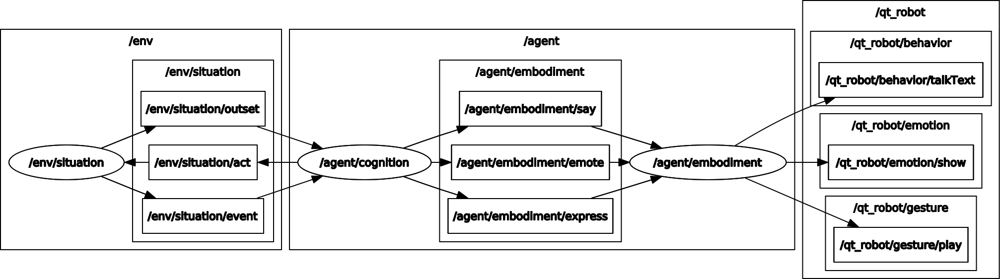

# JUSThink Robot

[](https://opensource.org/licenses/MIT)

## Overview

This repository contains the [ROS] package to generate the robot behaviour in a human-robot collaborative learning activity for school children, named [JUSThink](https://www.epfl.ch/labs/chili/index-html/research/animatas/justhink/). The scenario aims to improve their computational thinking skills by applying abstract and algorithmic reasoning to solve an unfamiliar problem on networks.

The pedagogical scenario consists of a sequence of activities: cover, introduction, tutorial, five individual activities (pretest), two collaborative activities, five individual activities (posttest), and a goodbye. In a collaborative activity, the human and the robot as (same-status) peers collaboratively construct a solution to this problem by deciding together which tracks to build, and submit it as their solution to the system. They take turns in suggesting to select a specific connection, where the other either agrees or disagrees with this suggestion. A track will be built only if it is suggested by one and accepted by the other.

This package makes use of [QTrobot](https://luxai.com/assistive-tech-robot-for-special-needs-education/) to enact the speech, gestures etc.

A human learner participates in the pedagogical scenario through an application ([justhink_scenario]). The robot behaviour is generated by this package ([justhink_agent]).

**Keywords:** artificial intelligence, human-robot interaction, situated dialogue, mutual modelling, collaborative learning, computational thinking

### License

The whole package is under MIT License, see [LICENSE](LICENSE).

This README is based on the project [ros_best_practices](https://github.com/leggedrobotics/ros_best_practices), Copyright 2015-2017, Péter Fankhauser. It is licensed under the BSD 3-Clause Clear License. See [doc/LICENSE](doc/LICENSE) for additional details.

**Author: Utku Norman<br />
Affiliation: [CHILI Lab, EPFL](https://www.epfl.ch/labs/chili/)<br />
Maintainer: Utku Norman, utku.norman@epfl.ch**

The [justhink_agent] package has been tested with [ROS Noetic](http://wiki.ros.org/noetic) and Python 3.8 (in Ubuntu 20.04 LTS).
This is research code, expect that it changes often and any fitness for a particular purpose is disclaimed.


Check out the the [ROS best practices](https://github.com/leggedrobotics/ros_best_practices) that which this README is based on.

### Publications

If you use this work in an academic context, please cite the following publication(s):

* U. Norman, B. Bruno, and P. Dillenbourg, **Mutual Modelling Ability for a Humanoid Robot: How can it improve my learning as we solve a problem together?,** in Robots for Learning Workshop in 16th annual IEEE/ACM Conference on Human-Robot Interaction (HRI 2021). ([PDF](http://infoscience.epfl.ch/record/283614))

        @conference{norman_mutual_2021,
        	author = {Norman, Utku and Bruno, Barbara and Dillenbourg, Pierre},
        	booktitle = {Robots for Learning Workshop in 16th annual {IEEE}/{ACM} Conference on Human-Robot Interaction ({HRI} 2021)},
        	title = {Mutual Modelling Ability for a Humanoid Robot: How can it improve my learning as we solve a problem together?},
        	url = {http://infoscience.epfl.ch/record/283614},
        	year = {2021},
        }


## Installation

### Building from Source

#### Dependencies

* [Robot Operating System (ROS)](http://wiki.ros.org) (middleware for robotics) for the communication between the human application and the robot
* [justhink_scenario] to display the application and run the pedagogical scenario 
* [justhink_world](https://github.com/utku-norman/justhink_world) to represent an activity as a world/problem with a state (that depends on [pomdp_py](https://h2r.github.io/pomdp-py/html/), [networkx](https://networkx.org/), [pyglet](https://pyglet.readthedocs.io/en/latest/), [importlib_resources](https://importlib-resources.readthedocs.io/en/latest/), and [pqdict](https://pypi.org/project/pqdict/))
* [justhink_msgs] for the custom ROS headers between [justhink_scenario] and [justhink_agent]
* [QTrobot ROS API headers](https://github.com/luxai-qtrobot/software/tree/master/headers)

#### Building

1) Install the [justhink_scenario] ROS package by following its [README](https://github.com/utku-norman/justhink_scenario/#readme).

2) Clone this [justhink_agent] ROS package (inside the 'src' folder of the catkin workspace, e.g. `~/catkin_ws/src`):
```
cd ~/catkin_ws/src 
git clone https://github.com/utku-norman/justhink_agent.git
```

3) Build the package (that also installs the justhink_agent Python package) with ROS:
```
cd ~/catkin_ws
catkin build justhink_robot
```

4) Build the QTrobot ROS API headers (following [here](https://github.com/luxai-qtrobot/software/tree/master/headers)) to run with the robot:
```
cd ~/catkin_ws/src/justhink_robot
mkdir -p temp; cd temp

# Clone and copy the headers.
git clone https://github.com/luxai-qtrobot/software.git
cp -r software/headers/* ~/catkin_ws/src/

# Cleanup.
cd ..; rm -rf temp

# Build the packages with ROS
cd ~/catkin_ws
catkin build qt_robot_interface qt_motors_controller qt_gesture_controller
```

5) Check the installation by running the following in a Python interpreter:
```
from justhink_robot.robot import PhysicalRobot
```

## Usage

### Running the JUSThink Human-Agent Scenario (with QTrobot)

1) To use with the robot, connect the the hotpot of the QTrobot (QTRDxxxxxx with password: 11111111) and then set up your environment:
```
export ROS_IP=192.168.4.114                       # Your ip from ifconfig
export ROS_MASTER_URI=http://192.168.4.1:11311
```

You can check if the QTroot ROS setup works by:
```
# Testing topics
rostopic pub -1 /qt_robot/speech/say std_msgs/String "data: 'Hi'"
rostopic pub -1 /qt_robot/gesture/play std_msgs/String "data: 'QT/hi'" 	# or e.g. QT/emotions/happy
rostopic pub -1 /qt_robot/gesture/play std_msgs/String "data: 'QT/Dance/Dance-1-1'"
rostopic pub -1 /qt_robot/gesture/play std_msgs/String "data: 'QT/yes'"


rostopic pub -1 /qt_robot/head_position/command std_msgs/Float64MultiArray "data: [0, -15]"   # head up
rostopic pub -1 /qt_robot/head_position/command std_msgs/Float64MultiArray "data: [0, 25]"   # head down


rostopic echo /qt_robot/head_position/command

rostopic pub -1 /qt_robot/head_position/command std_msgs/Float64MultiArray "data: [0, 10]"   # head you

head: HeadYaw [min: -90.0, max: 90] HeadPitch [min: -15.0, max: 25]

rostopic echo /qt_robot/joints/state

rosrun image_view image_view image:=/camera/color/image_raw _autosize:=True
rostopic hz /camera/color/image_raw

sudo ip route add 192.168.100.2 via 192.168.4.1 dev wlp59s0
rostopic echo --noarr /camera/color/image_raw


rostopic pub -1 /agent/embodiment/say std_msgs/String "data: 'Hi'"

# Testing services
rosservice call /qt_robot/behavior/talkText "message: 'Hi'"
rostopic pub -1 /qt_robot/gesture/play std_msgs/String "data: 'epfl/justhink/point_front_head_forward'"
rosservice call /qt_robot/setting/setVolume 75     # set low voice. e.g. 95 is high. 52 is barely audible.
```

2) (optional) Set the volume level of the robot.
```
rosservice call /qt_robot/setting/setVolume 52    # for development
rosservice call /qt_robot/setting/setVolume 75    # for experiment
```

3) (optional) In another terminal, start logging:
```
NO=1 # Student No
rosrun justhink_robot run_recorder.sh $NO
```

4) In another terminal, start this embodiment node:
```
# JUSTHINK_WORLD_DIR points to the location of the justhink_world source code.
source $JUSTHINK_WORLD_DIR/venv/bin/activate

export ROS_LOG_DIR=$(rospack find justhink_robot)/data/log
rm $ROS_LOG_DIR/agent_embodiment.log
export ROS_NAMESPACE=agent
rosrun justhink_robot run_robot.py
```

5) In another terminal, start the cognition node:
```
# JUSTHINK_WORLD_DIR points to the location of the justhink_world source code.
source $JUSTHINK_WORLD_DIR/venv/bin/activate

export ROS_LOG_DIR=$(rospack find justhink_agent)/data/log
rm $ROS_LOG_DIR/agent_cognition.log
export ROS_NAMESPACE=agent
rosrun justhink_agent run_agent.py _instruct:=True

rosrun justhink_agent run_agent.py _instruct:=False
```

6) In another terminal, start the situation node.
```
source $JUSTHINK_WORLD_DIR/venv/bin/activate

export ROS_LOG_DIR=$(rospack find justhink_scenario)/data/log
rm $ROS_LOG_DIR/env_situation.log
export ROS_NAMESPACE=env
rosrun justhink_scenario run_scenario.py
```

Testing justhink_robot node
```
rostopic pub -1 /agent/embodiment/say std_msgs/String "data: 'Hi'"
rosservice call /agent/embodiment/say "message: 'Hi.'"

rosservice call /agent/embodiment/express 'epfl/justhink/show_QT_head_down' 1
rostopic pub -1 /agent/embodiment/express std_msgs/String "data: 'epfl/old_QT/no'"
```

### Useful Commands

For development, lower the voice of the robot:
```
rosservice call /qt_robot/setting/setVolume 52
```


For experiment, set the voice of the robot to higher level:
```
rosservice call /qt_robot/setting/setVolume 95
```

Try speech and gestures:
```
# Via services.
rosservice call /qt_robot/behavior/talkText "message: 'Hi.'"

rosservice call /qt_robot/gesture/play 'epfl/justhink/show_QT_head_down' 1
rosservice call /qt_robot/motors/home ['HeadPitch'] # Home head
rosservice call /qt_robot/motors/home "['HeadPitch', 'left_arm', 'right_arm']"  # Home all

rosservice call /qt_robot/gesture/play 'epfl/justhink/point_front_head_forward' 1

# Via messages.
rostopic pub -1 /qt_robot/gesture/play std_msgs/String "data: 'epfl/justhink/point_front_head_forward'"
rostopic pub -1 /qt_robot/gesture/play std_msgs/String "data: 'epfl/old_QT/no'"
rosservice call /qt_robot/gesture/play 'QT/show_tablet' 1


rosservice call /qt_robot/gesture/play 'QT/Dance/Dance-1-1' 1
rosservice call /qt_robot/gesture/play 'QT/Dance/Dance-1-2' 1
rosservice call /qt_robot/gesture/play 'QT/Dance/Dance-1-3' 1
rosservice call /qt_robot/gesture/play 'QT/Dance/Dance-1-4' 1

rosservice call /qt_robot/gesture/play 'QT/Dance/Dance-2-1' 1
rosservice call /qt_robot/gesture/play 'QT/Dance/Dance-2-2' 1
rosservice call /qt_robot/gesture/play 'QT/Dance/Dance-2-3' 1
rosservice call /qt_robot/gesture/play 'QT/Dance/Dance-2-4' 1

rosservice call /qt_robot/gesture/play 'QT/Dance/Dance-3-1' 1
rosservice call /qt_robot/gesture/play 'QT/Dance/Dance-3-2' 1
rosservice call /qt_robot/gesture/play 'QT/Dance/Dance-3-3' 1

rosservice call /qt_robot/gesture/play 'QT/Dance/Dance-4-1' 1
rosservice call /qt_robot/gesture/play 'QT/Dance/Dance-4-2' 1
rosservice call /qt_robot/gesture/play 'QT/Dance/Dance-4-3' 1
rosservice call /qt_robot/gesture/play 'QT/Dance/Dance-4-4' 1
rosservice call /qt_robot/gesture/play 'QT/Dance/Dance-4-5' 1
rosservice call /qt_robot/gesture/play 'QT/Dance/Dance-4-6' 1

```


## Nodes

### justhink_robot

Launches the JUSThink robot driver.

The ROS computation graph (as visualised by [rqt_graph](http://wiki.ros.org/rqt_graph)) is as follows:





#### Subscribed Topics

* **`say`** ([std_msgs/String])

	Commands sent for the robot to make an utterance. For example, you can trigger this from the terminal with

		rostopic pub -1 /agent/embodiment/say std_msgs/String "data: 'Hi'"

* **`express`** ([std_msgs/String])

	Commands sent for the robot to make a gesture. For example

		rostopic pub -1 /agent/embodiment/express std_msgs/String "data: 'point_human'"


* **`emote`** ([std_msgs/String])

	Commands sent for the robot to display an (e.g. facial) emotion expression. For example

		rostopic pub -1 /agent/embodiment/emote std_msgs/String "data: 'QT/showing_smile'"


#### Published Topics

##### For QTrobot

* **`/qt_robot/behavior/talkText`** ([std_msgs/String])

	Commands sent for the robot to make an utterance.

* **`/qt_robot/gesture/play`** ([std_msgs/String])

	Commands sent for QTrobot to make a gesture.

* **`/qt_robot/emotion/show`** ([std_msgs/String])

	Commands sent for QTrobot to display a facial expression.


#### Services

* **`say`** ([[justhink_msgs/Say]](https://github.com/utku-norman/justhink_msgs/blob/main/srv/Say.srv))

	Makes the robot say an utterance. For example, you can trigger this from the terminal with

		rosservice call /agent/embodiment/say "message: 'Hi'"

* **`express`** ([[justhink_msgs/Express]](https://github.com/utku-norman/justhink_msgs/blob/main/srv/Express.srv))

	Makes the robot express a gesture. For example

		rosservice call /agent/embodiment/express 'point_self' 1

* **`emote`** ([[justhink_msgs/Emote]](https://github.com/utku-norman/justhink_msgs/blob/main/srv/Emote.srv))

	Makes the robot express an emotion. For example

		rosservice call /agent/embodiment/emote "name: 'happy'"

* **`home`** ([[justhink_msgs/Home]](https://github.com/utku-norman/justhink_msgs/blob/main/srv/Home.srv))

	Home parts of the robot.

		rosservice call /agent/embodiment/home ['HeadPitch']    # Home head
		rosservice call /agent/embodiment/home "['HeadPitch', 'left_arm', 'right_arm']"    # Home all

* **`configure_speech`** ([[justhink_msgs/ConfigureSpeech]](https://github.com/utku-norman/justhink_msgs/blob/main/srv/ConfigureSpeech.srv))

	Configure robot speech: language, pitch, speed

		# rosservice call /qt_robot/speech/config en-US 100 80
		rosservice call /agent/embodiment/configure_speech en-US 100 80
		
* **`stop_say`** ([[justhink_msgs/StopSay]](https://github.com/utku-norman/justhink_msgs/blob/main/srv/StopSay.srv))

	Stop robot speech.

		rosservice call /agent/embodiment/stop_say

* **`stop_emote`** ([[justhink_msgs/StopSay]](https://github.com/utku-norman/justhink_msgs/blob/main/srv/StopSay.srv))

	Stop robot express an emotion.

		rosservice call /agent/embodiment/stop_emote

* **`stop_express`** ([[justhink_msgs/StopExpress]](https://github.com/utku-norman/justhink_msgs/blob/main/srv/StopExpress.srv))

	Stop robot express a gesture.

		rosservice call /agent/embodiment/stop_express


## Acknowledgements

This project has received funding from the European Union's Horizon 2020 research and innovation programme under grant agreement No 765955. Namely, the [ANIMATAS Project](https://www.animatas.eu/).

## Bugs & Feature Requests

Please report bugs and request features using the [Issue Tracker](https://github.com/utku-norman/justhink_agent/issues).


[ROS]: http://www.ros.org
[justhink_world]: https://github.com/utku-norman/justhink_world
[justhink_scenario]: https://github.com/utku-norman/justhink_scenario
[justhink_agent]: https://github.com/utku-norman/justhink_agent
[justhink_robot]: https://github.com/utku-norman/justhink_robot
[justhink_msgs]: https://github.com/utku-norman/justhink_msgs
